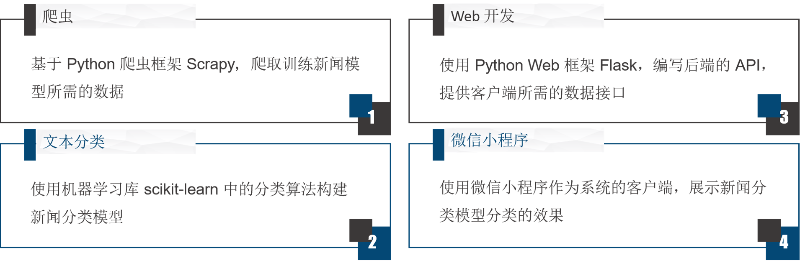
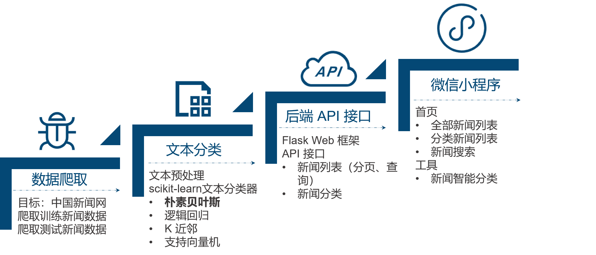
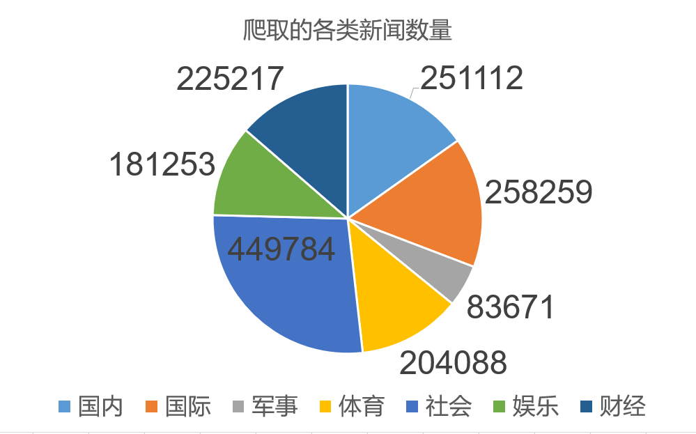
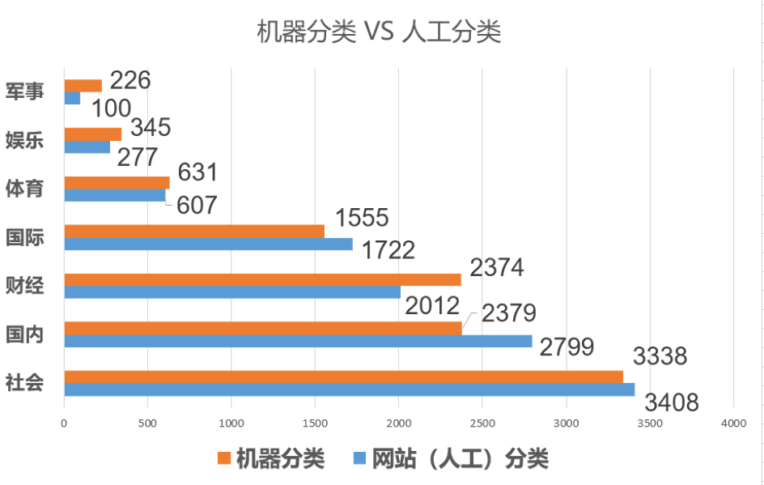
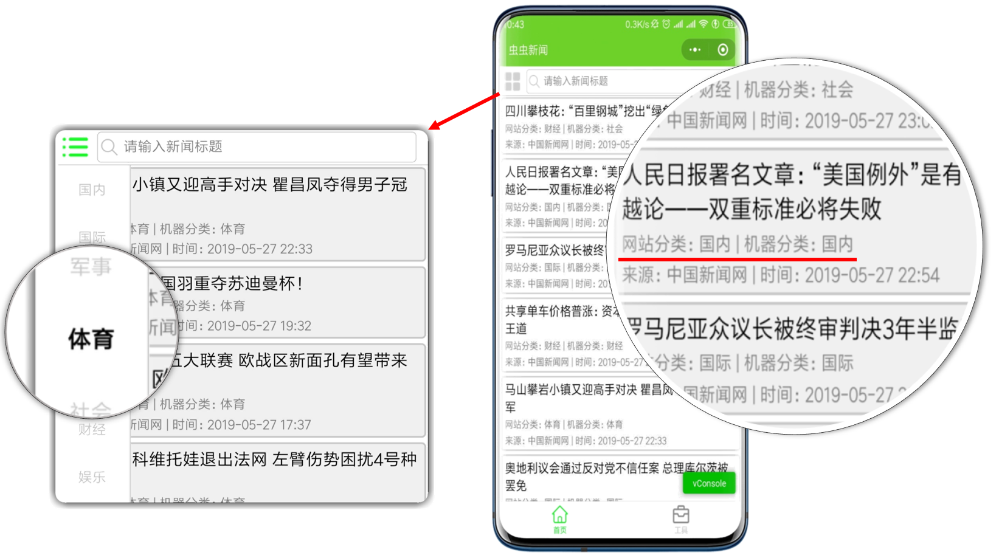
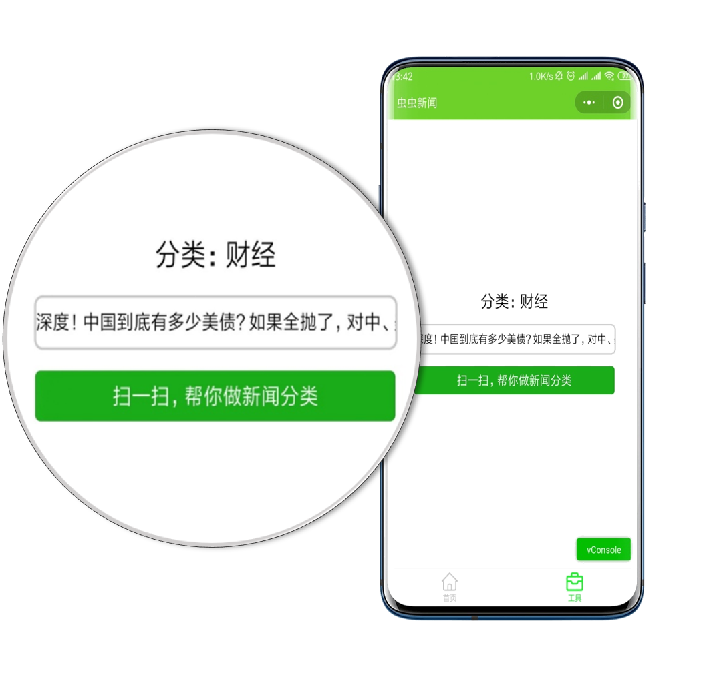
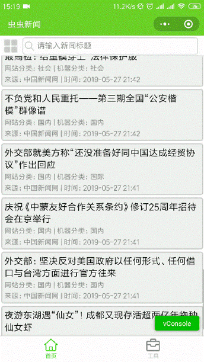

# 基于 Scrapy 的新闻智能分类微信小程序

## 1、项目介绍

该项目是我的毕业设计，是一个文本分类相关的应用，目的是打造出一个可以对新闻进行智能分类的微信小程序。

## 2、技术栈

Python + Scrapy + MongoDB + scikit-learn + Flask + 微信小程序，涉及爬虫、文本分类、Web 开发和微信小程序。

## 3、系统架构图

系统架构图如下图所示，分为基础设施层、服务层、交互层、应用层。

## 4、实现步骤

整个系统的实现分为如下四个步骤，分别是新闻数据爬取、文本分类处理、后端 API 接口开发，微信小程序客户端构建。

### 4.1 数据爬取

爬虫的目标网站为中国新闻网，新闻数据爬取分类为：国内、国际、军事、体育、社会、娱乐、财经，爬取新闻的时间跨度为 2012 年到 2019 年。

### 4.2 文本分类

文本分类的效果如下图所示，橙色和蓝色的数量约接近，代表这个分类下的新闻机器分类正确率越高，可以看到由于上面军事类新闻的数量较少，所以训练出来的新闻分类模型效果不是很高，错误率较高。

## 5、效果演示

### 5.1 小程序首页

小程序首页展示新闻列表，点击新闻条目可以查看新闻详情，可以点击分类按钮选择新闻分类，还可以输入关键字查找新闻。

### 5.2 小程序工具页

### 5.3 新闻分类功能演示

下面通过动图来演示该小程序的特色功能-新闻分类功能。

